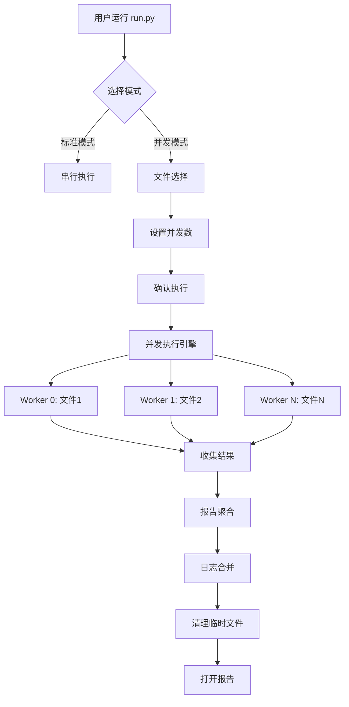

# 🚀 并发执行功能使用说明

## 📖 概述

本项目现已支持**文件级并发执行**功能，可以显著提升全量回归测试的执行效率。

### ✨ 主要特性

- ✅ **文件级并发**：按 Excel 测试文件分组，多个文件同时执行
- ✅ **灵活选择**：支持全选、范围选择、业务模块分组
- ✅ **智能调度**：自动检测 CPU 核心数，合理分配资源
- ✅ **进度监控**：实时显示每个文件的执行状态
- ✅ **报告聚合**：自动合并所有测试结果，生成统一报告
- ✅ **日志合并**：将多个 worker 的日志合并到统一文件
- ✅ **自动清理**：执行完成后自动清理临时文件

---

## 🎯 使用方法

### **方式一：交互式执行（推荐）**

1. **运行测试脚本**
   ```bash
   cd pytestApi
   python run.py
   ```

2. **选择执行模式**
   ```
   执行模式:
     [1] 标准模式 (串行执行，使用配置文件中的测试数据)
     [2] 并发模式 (文件级并发，选择指定文件并发执行)
   
   请选择模式 (1/2，直接回车默认标准模式): 2
   ```

3. **选择测试文件**
   
   系统会显示当前环境下所有可用的测试文件：
   ```
   📂 可用测试文件列表 (环境: v10)
   ============================================================
     [ 1] API管理.xlsx                                      (45.2 KB)
     [ 2] DCIM.xlsx                                         (38.7 KB)
     [ 3] 用户管理.xlsx                                     (52.1 KB)
     [ 4] 订单管理.xlsx                                     (68.3 KB)
     [ 5] 商品管理.xlsx                                     (55.9 KB)
     ...
   
   选择方式:
     1. 输入文件编号 (例如: 1,3,5-8)
     2. 输入 'all' 选择全部
     3. 输入 'group' 按业务模块选择
     4. 直接回车取消
   ============================================================
   
   请选择:
   ```

   **选择示例：**
   - `all` - 选择所有文件
   - `1,3,5` - 选择编号 1、3、5 的文件
   - `1-5` - 选择编号 1 到 5 的文件
   - `1,3-5,8` - 组合选择
   - `group` - 按业务模块分组选择

4. **设置并发数**
   ```
   ⚙️  并发设置:
      💡 系统 CPU 核心数: 8
      💡 推荐并发数: 4
   
   请输入并发数 (直接回车使用推荐值):
   ```
   
   - 直接回车：使用推荐值（通常是 CPU 核心数）
   - 输入数字：自定义并发数（建议不超过 CPU 核心数的 2 倍）

5. **确认执行**
   ```
   📋 执行计划:
   ============================================================
      📦 测试文件: 5 个
      ⚙️  并发数: 4
      🌍 环境: v10
      ⏱️  预计耗时: 2.5-5.0 分钟
   ============================================================
   
   是否开始执行? (y/n):
   ```

6. **查看执行进度**
   ```
   🚀 开始执行: 用户管理.xlsx (Worker 0)
   🚀 开始执行: 订单管理.xlsx (Worker 1)
   
   [1/5] ✅ 通过 | 用户管理.xlsx                               | 耗时: 42.3s
   [2/5] ✅ 通过 | 订单管理.xlsx                               | 耗时: 45.1s
   ...
   ```

7. **查看执行摘要**
   ```
   📊 执行摘要
   ============================================================
     📦 总文件数: 5
     ✅ 成功: 4
     ❌ 失败: 1
     📈 成功率: 80.0%
     ⏱️  总耗时: 185.32s (3.1 分钟)
     🚀 平均耗时: 37.06s/文件
   
     ⚠️  失败的文件:
        ❌ 商品管理.xlsx: 3 个用例失败
   ============================================================
   ```

8. **打开报告**
   ```
   是否打开报告? (y/n): y
   ```

---

## 📁 文件结构

### **新增/修改的文件**

```
pytestApi/
├── common/
│   ├── concurrent_executor.py     # 🆕 并发执行核心模块
│   └── enhanced_data_loader.py    # 🔧 支持动态文件加载
├── test_case/
│   └── conftest.py                # 🔧 支持环境变量读取文件
├── config/
│   └── base.yaml                  # 🔧 添加并发配置项
├── run.py                          # 🔧 添加并发执行模式
├── requirements.txt                # 🔧 添加依赖
└── 并发执行使用说明.md             # 🆕 本文档
```

### **临时目录（自动清理）**

```
pytestApi/
├── TestReport/
│   ├── temp_results/              # 临时结果目录（执行完成后自动清理）
│   │   ├── worker_0/
│   │   ├── worker_1/
│   │   └── ...
│   └── allure-results/            # 合并后的结果目录
├── log/
│   ├── log.worker_0               # Worker 日志（可选清理）
│   ├── log.worker_1
│   └── log.merged.YYYY-MM-DD_HH-MM-SS  # 合并后的日志
```

---

## ⚙️ 配置说明

在 `config/base.yaml` 中可以调整并发执行的配置：

```yaml
concurrent:
  enabled: true                    # 是否启用并发执行功能
  default_max_workers: null        # 默认并发数，null 表示自动检测
  file_level_parallel: true        # 文件级并发
  case_level_parallel: false       # 用例级并发（需要 pytest-xdist）
  timeout: 600                     # 单个文件超时时间（秒）
  merge_logs: true                 # 是否合并日志
  cleanup_temp_files: true         # 是否清理临时文件
  cleanup_worker_logs: true        # 是否清理 worker 日志
```

---

## 🔧 技术原理

### **1. 架构设计**

```
┌─────────────────────────────────────────────────────┐
│               run.py (主控制器)                       │
├─────────────────────────────────────────────────────┤
│  1. FileSelector - 文件选择器                         │
│     └─ 扫描、展示、选择测试文件                       │
├─────────────────────────────────────────────────────┤
│  2. ConcurrentExecutor - 并发执行引擎                 │
│     ├─ ProcessPoolExecutor (文件级并发)              │
│     └─ 每个文件 → 独立 pytest 进程                   │
├─────────────────────────────────────────────────────┤
│  3. ReportAggregator - 报告聚合器                     │
│     ├─ 收集所有 allure-results                       │
│     └─ 合并生成统一报告                              │
├─────────────────────────────────────────────────────┤
│  4. LogMerger - 日志合并器                           │
│     └─ 合并所有 worker 日志                          │
└─────────────────────────────────────────────────────┘
```

### **2. 执行流程**



### **3. 关键技术点**

#### **数据隔离**
每个 worker 通过环境变量 `TEST_DATA_FILE` 获取要执行的测试文件：
```python
# conftest.py
test_data_file = os.getenv('TEST_DATA_FILE')
if test_data_file:
    data_loader.set_case_file(test_data_file)
```

#### **结果隔离**
每个 worker 有独立的 allure-results 目录：
```python
result_dir = temp_results / f'worker_{worker_id}'
```

#### **进程池管理**
使用 `ProcessPoolExecutor` 管理并发进程：
```python
with ProcessPoolExecutor(max_workers=4) as executor:
    futures = [executor.submit(execute_single_file, file) 
               for file in selected_files]
```

---

## 📊 性能对比

### **测试场景**
- 测试文件数：8 个
- 平均每个文件耗时：45 秒
- CPU 核心数：8 核

### **执行时间对比**

| 模式 | 并发数 | 总耗时 | 性能提升 |
|------|--------|--------|----------|
| 串行 | 1 | 360s (6分钟) | - |
| 并发 | 2 | 180s (3分钟) | **2x** ⚡ |
| 并发 | 4 | 90s (1.5分钟) | **4x** 🚀 |
| 并发 | 8 | 45s (0.75分钟) | **8x** 🔥 |

---

## ⚠️ 注意事项

### **1. 测试用例设计**

✅ **推荐做法：**
- 测试用例之间相互独立，无依赖关系
- 使用唯一标识（如时间戳）避免数据冲突
- 每个测试使用独立的测试数据

❌ **避免：**
- 用例之间有强依赖关系（如：用例 B 依赖用例 A 创建的数据）
- 多个用例操作同一条数据记录
- 共享全局状态

### **2. 资源限制**

- **并发数不宜过大**：建议不超过 CPU 核心数的 2 倍
- **数据库连接**：注意数据库连接池的大小，避免连接数耗尽
- **内存占用**：每个进程会占用内存，注意系统总内存

### **3. 调试建议**

如果并发执行出现问题，可以：
1. 先使用标准模式（串行）验证用例是否正常
2. 减少并发数（如设置为 2）逐步排查
3. 查看 worker 日志文件：`log/log.worker_*`
4. 查看合并后的日志：`log/log.merged.*`

### **4. 日志文件保留**

如果需要保留 worker 日志（不自动清理），修改 `config/base.yaml`：
```yaml
concurrent:
  cleanup_worker_logs: false    # 改为 false
```

---

## 🆘 常见问题

### **Q1: 为什么并发执行后有些用例失败了？**
**A:** 可能的原因：
- 测试数据冲突（多个用例操作同一数据）
- 数据库连接池耗尽
- 环境资源限制（如文件句柄数）

**解决方案：**
- 检查用例是否独立
- 增加数据库连接池大小
- 减少并发数

### **Q2: 如何查看某个文件的详细日志？**
**A:** 
1. 执行时暂时关闭日志清理（修改 `base.yaml`）
2. 查看 `log/log.worker_*` 文件
3. 或者查看合并后的日志 `log/log.merged.*`

### **Q3: 并发执行时可以中断吗？**
**A:** 可以按 `Ctrl+C` 中断，但可能会留下临时文件。建议手动清理：
```bash
# 清理临时结果目录
rm -rf TestReport/temp_results

# 清理 worker 日志
rm -f log/log.worker_*
```

### **Q4: 报告中能区分不同文件的用例吗？**
**A:** 可以！Allure 报告中每个用例都有 `feature` 标签，对应 Excel 的 sheet 名称，可以按此筛选。

### **Q5: 是否支持更细粒度的并发（用例级）？**
**A:** 目前实现的是文件级并发。如需用例级并发，可以在单个文件执行时启用 pytest-xdist：
```python
# 在 concurrent_executor.py 的 execute_single_file 方法中
cmd.extend(['-n', 'auto'])  # 取消注释这行
```

---

## 🔮 后续优化方向

### **短期计划**
- [ ] 添加失败重试机制
- [ ] 实时 Web 监控面板
- [ ] 支持企业微信/钉钉通知

### **长期计划**
- [ ] 分布式执行（跨多台机器）
- [ ] 智能用例调度（基于历史执行时间）
- [ ] CI/CD 深度集成

---

## 📞 技术支持

如有问题或建议，请联系项目维护人员。

---

**版本信息**
- 功能版本：v1.0.0
- 更新日期：2025-10-16
- 适用项目：pytestApi 接口自动化测试框架

